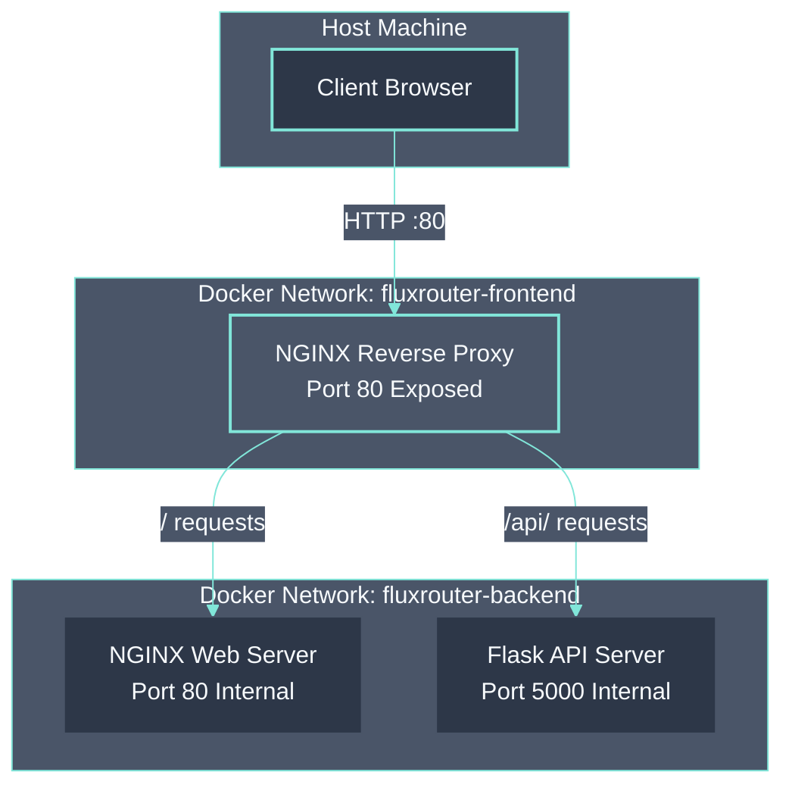
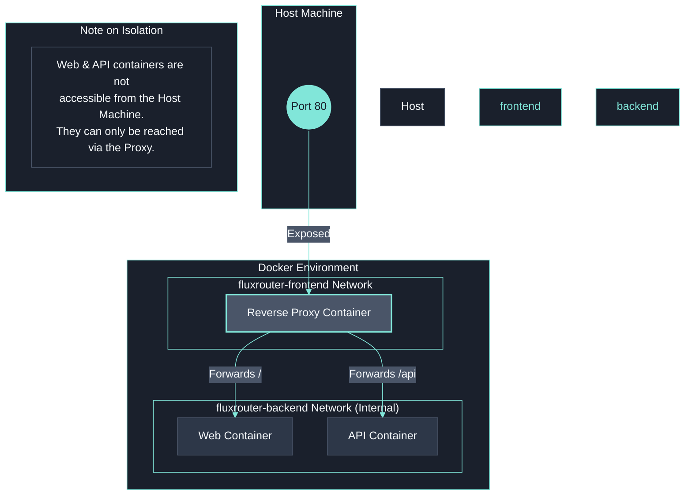
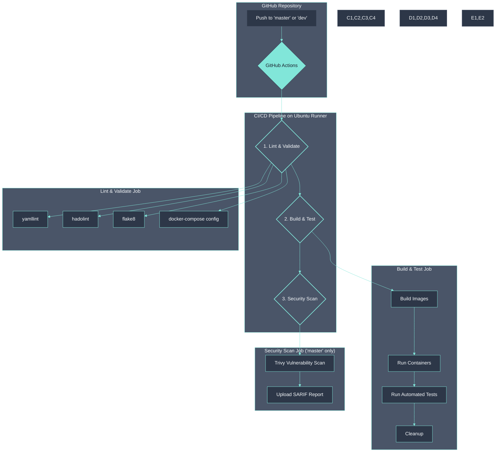

# FluxRouter - Containerized Web Platform

A containerized web platform built with DevOps practices, featuring a secure reverse proxy architecture, dynamic API service, and an automated CI/CD pipeline.

## 📋 Project Phases

### ✅ Phase 1: Basic Level (Completed)

- Reverse proxy with NGINX
- Static web server container
- Docker Compose orchestration
- Security hardening & Network isolation

### ✅ Phase 2: Intermediate Level (Completed)

- Flask backend API with health endpoints
- Updated NGINX routing for API traffic
- Environment variable management
- Health checks for all services
- GitHub Actions CI/CD pipeline

### ✅ Phase 3: Expert Level (Completed)

- HTTPS with self-signed certificates
- HTTP to HTTPS redirection
- Unit tests for backend application
- Extended testing suite
- Custom backend image from Alpine
- Advanced CI/CD pipeline
- Horizontal scaling with Docker Compose
- Failure handling & load balancing

---

## 🏛️ Architecture and Design

The solution is designed around a reverse proxy model, providing a secure and scalable foundation. All inbound traffic is handled by a single NGINX proxy that routes requests to the appropriate internal services, which are isolated from the host machine.

### Overall Architecture



### Network Isolation

Network security is a key design feature, achieved using two custom Docker networks:

- **`fluxrouter-frontend`**: The external network for the reverse proxy. It's the only service with a port exposed to the host machine.
- **`fluxrouter-backend`**: A completely internal network. Services within this network are not reachable from the host, forcing all traffic through the security layers of the proxy.



---

## 🚀 Quick Start

### Prerequisites

- Docker and Docker Compose
- Git

o use### Scaling Backend Services

FluxRouter supports horizontal scaling of backend services:

```bash
# Start with 2 backend instances
docker compose up --scale backend=2 -d
```

See [Scaling Guide](docs/scaling.md) for more details.

### Running the Platform

```bash
# 1. Clone the repository
git clone <your-repo-url>
cd FluxRouter

# 2. Run the setup script to create your .env file and generate a secret key
./setup.sh

# 3. Start all services
docker compose up -d

# 4. Check service status
docker compose ps
```

---

## 🔧 Services Breakdown

### Reverse Proxy (NGINX)

- **Image**: Custom NGINX on Alpine Linux.
- **Function**: The single entry point for all traffic. Routes requests, applies security policies, and terminates client connections.
- **Health Check**: `GET /health`
- **Security**: Blocks unwanted HTTP methods (TRACE, OPTIONS) and adds security headers.

### Web Server (NGINX)

- **Image**: Custom NGINX on Alpine Linux.
- **Function**: Serves the static HTML front-end content.
- **Health Check**: `GET /`
- **Access**: Internal network only. Cannot be accessed directly from the host.

### Backend API (Flask)

- **Image**: Custom Python 3 on Alpine, with Gunicorn for production.
- **Function**: Provides a RESTful API.
- **Health Check**: `GET /api/health`
- **Endpoints**:
  - `GET /api/health`: Confirms the service is running.
  - `GET /api/info`: Provides API metadata.
  - `GET /api/status`: Shows current application status.
- **Access**: Internal network only.

---

## 🧪 Manual Testing and Usage

This section provides a comprehensive guide to manually testing the functionality of the FluxRouter platform, with tests mapped directly to the project objectives for each phase.

### Basic Docker Compose Commands

Before you begin, here are the essential Docker Compose commands for managing the services:

- **Start all services in detached mode:**
  
  ```bash
  docker compose up -d
  ```

- **Stop all services:**
  
  ```bash
  docker compose down
  ```

- **View the status of all running containers:**
  
  ```bash
  docker compose ps
  ```

- **View logs for all services (or a specific one):**
  
  ```bash
  # Tail logs for all services
  docker compose logs -f
  
  # View logs for a specific service (e.g., backend)
  docker compose logs -f backend
  ```

- **Run a command inside a running container:**
  
  ```bash
  # Open a shell inside the backend container
  docker compose exec backend /bin/sh
  ```

### Phase 1: Basic Level Verification

#### Objective: Build a minimal local web platform using containers.

1. **Reverse Proxy and Web Server Containers**
   
   - **Requirement**: A reverse proxy (NGINX) and one or more web server containers serving static HTML.
   - **Verification**:
     - Check that all three initial containers (`proxy`, `web`, `backend`) are running:
       
       ```bash
       docker compose ps
       ```
     - Access the web server through the proxy. The response should contain "Hello from Web Server via Reverse Proxy!".
       
       ```bash
       curl http://localhost/
       ```

2. **Network Isolation**
   
   - **Requirement**: The reverse proxy is the single entry point. Web server containers are not directly accessible from the host.
   - **Verification**:
     - Confirm that only port 80 on the `proxy` service is exposed by inspecting the output of `docker compose ps`.
     - Attempting to access the `web` container directly will fail. To prove this, find the `web` container's IP on the internal `fluxrouter-backend` network and try to curl it from the host machine (this command should hang and time out).
       
       ```bash
       # This will fail, proving the container is not exposed
       WEB_IP=$(docker inspect -f '{{range.NetworkSettings.Networks}}{{.IPAddress}}{{end}}' $(docker compose ps -q web))
       curl http://$WEB_IP
       ```

3. **Security Hardening**
   
   - **Requirement**: The reverse proxy blocks specific HTTP methods and adds security headers.
   - **Verification**:
     - Check for security headers like `X-Frame-Options` and `Content-Security-Policy`.
       
       ```bash
       curl -I http://localhost/
       ```
     - Verify that dangerous methods like `TRACE` are blocked. This should return a `405 Not Allowed` response.
       
       ```bash
       curl -X TRACE -I http://localhost/
       ```

### Phase 2: Intermediate Level Verification

#### Objective: Extend the solution with a backend application and CI/CD automation.

1. **Backend Application Container**
   
   - **Requirement**: A simple API (Flask) with a health endpoint at `/api/health`.
   - **Verification**:
     - Test the API's health endpoint through the reverse proxy. It should return a JSON response with `{"status": "ok"}`.
       
       ```bash
       curl http://localhost/api/health | jq .
       ```

2. **NGINX Routing for Web and API**
   
   - **Requirement**: NGINX proxies both static (`/`) and API (`/api`) traffic to the correct containers.
   - **Verification**:
     - Test the web endpoint (should be served by the `web` container).
       
       ```bash
       curl http://localhost/
       ```
     - Test an API endpoint (should be served by the `backend` container).
       
       ```bash
       curl http://localhost/api/info | jq .
       ```

3. **Docker Health Checks**
   
   - **Requirement**: `HEALTHCHECK` instructions are added for both backend and web servers.
   - **Verification**:
     - The `STATUS` column in the `docker compose ps` output should show `(healthy)` for the `web` and `backend` services after a few seconds.
       
       ```bash
       docker compose ps
       ```

### Phase 3: Expert Level Verification

#### Objective: Design a production-like system with HTTPS, observability, and robust deployment.

1. **Enable HTTPS**
   
   - **Requirement**: NGINX serves traffic over HTTPS using a self-signed certificate, and HTTP requests are redirected to HTTPS.
   - **Verification**:
     - Access the site over HTTPS. Use the `-k` flag with `curl` to ignore self-signed certificate warnings.
       
       ```bash
       curl -k https://localhost/
       ```
     - Check that an HTTP request receives a `301 Moved Permanently` redirect to the HTTPS URL.
       
       ```bash
       curl -I http://localhost/
       ```

2. **Extended Testing (Unit Tests)**
   
   - **Requirement**: Unit tests are available for the backend application.
   - **Verification**:
     - Execute the `pytest` suite inside the `backend` container.
       
       ```bash
       docker compose exec backend pytest
       ```

3. **Failure Handling and Load Balancing**
   
   - **Requirement**: The system can handle container failure and balance load across multiple backend instances.
   
   - **Verification**:
     
     - Start the platform with multiple backend replicas:
       
       ```bash
       docker compose up -d --scale backend=3
       ```
     
     - Check the logs of the `proxy` to see which backend container is serving requests. You should see requests being distributed among the replicas (`backend-1`, `backend-2`, `backend-3`).
       
       ```bash
       docker compose logs -f proxy
       ```
     
     - Simulate a failure by killing one of the backend containers. Requests should automatically be routed to the remaining healthy instances.
       
       ```bash
       # Kill one backend container
       docker compose stop backend-2
       
       # Continue to curl the API; requests should still be served without error
       curl http://localhost/api/health
       ```

## 🚀 CI/CD Pipeline

The GitHub Actions pipeline automates the validation, testing, and security scanning of the entire platform on every push to the `master` or `dev` branches.

### Pipeline Visualization



### Pipeline Stages

1. **Lint & Validate**: Checks all source code for style errors and syntax issues (`flake8`, `yamllint`, `hadolint`).
2. **Build & Test**: Builds all Docker images, runs the full container stack, and executes a suite of integration tests against the live services.
3. **Security Scan**: On pushes to `master`, it runs a Trivy vulnerability scan against the codebase and Docker images.

---

## 🔒 Security Features

### Network Security

- ✅ **Internal-only Networks**: The `web` and `backend` services are on an internal network and cannot be reached from the host.
- ✅ **Single Entry Point**: The only way to access the system is through the reverse proxy on port 80.

### Application Security

- ✅ **Security Headers**: The reverse proxy adds key security headers like `X-Frame-Options` and `Content-Security-Policy`.
- ✅ **HTTP Method Filtering**: Dangerous methods like `TRACE` and `OPTIONS` are blocked.
- ✅ **Non-Root Execution**: All containers run their processes as an unprivileged user.

### Infrastructure Security

- ✅ **Minimal Base Images**: All images are built on `alpine` to reduce the attack surface.
- ✅ **Health Checks**: Docker health checks ensure that failing containers are automatically restarted.
- ✅ **Automated Scanning**: The CI/CD pipeline includes vulnerability scanning.

---

## 🔧 Configuration

### Environment Variables

Configuration is managed through a `.env` file, which is created from `env.example`.

- `ENVIRONMENT`: Sets the application environment (e.g., `development`).
- `FLASK_ENV`: Sets the Flask environment (`production` or `development`).
- `DEBUG`: Toggles debug mode (`true` or `false`).
- `SECRET_KEY`: A long, random string used for cryptographic signing.

> **Note:** The `.env` file should **never** be committed to version control.

---

## 📁 Project Structure

```
FluxRouter/
├── .github/workflows/    # CI/CD pipeline workflow
├── backend/              # Flask API service source
├── proxy/                # NGINX reverse proxy configuration
├── tests/                # Verification scripts
├── web/                  # Static web server source
├── docker-compose.yml    # Main service orchestration file
├── .env.example          # Template for environment variables
└── README.md             # This file
```
